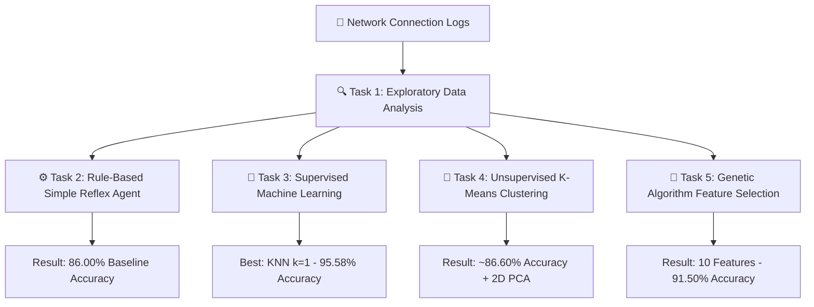

# 🛡️ Network Intrusion Detection System (NIDS)

<p align="center">
  
  
  
  
  
</p>

An intelligent Network Intrusion Detection System built using classical AI algorithms and machine learning techniques to classify network connections as **Normal (0)** or **Attack (1)**.

> 🏆 **Top Result:** K-Nearest Neighbors ($k=1$) achieved **95.58% Test Accuracy** with a **0.9563 F1-Score**.

---

## 👥 Authors & Contributions

* **Course:** Artificial Intelligence — Semester Project
* **Group Members:**
  * **Azaan Noor Khuwaja** *(Roll # 24P-0706)* — EDA, Reflex Agent, Supervised Learning (Tasks 1, 2, 3)
  * **M. Uzair Shoaib** *(Roll # 24P-0507)* — Custom K-Means, PCA Visualizations, Genetic Algorithm (Tasks 4, 5)

---

## ⚡ Quick Start (TL;DR)

Get up and running in under 60 seconds:

```bash
# 1. Clone the repository
git clone https://github.com/aazannoorkhuwaja/Network-Intrusion-Detection.git
cd Network-Intrusion-Detection

# 2. Install dependencies
pip install notebook numpy pandas matplotlib scikit-learn

# 3. Launch Jupyter & run notebook
jupyter notebook AI_Final_Project.ipynb
```

---

## 🧠 System Architecture Pipeline



---

## 📊 Benchmark Results Summary

| Model / Algorithm | Category | Accuracy | Precision | Recall | F1-Score | Key Feature / Finding |
|---|---|:---:|:---:|:---:|:---:|---|
| **Simple Reflex Agent** | Rule-Based Heuristic | 86.00% | 0.8241 | 0.9160 | 0.8676 | Condition-action baseline rules (`serror_rate`, `same_srv_rate`, `count`). |
| **Gaussian Naïve Bayes** | Supervised (Probabilistic) | 78.75% | 0.9320 | 0.6167 | 0.7420 | Feature correlation violates independence assumption. |
| **Logistic Regression (All Features)** | Supervised (Linear) | 91.83% | 0.9022 | 0.9383 | 0.9199 | Strong linear benchmark; fast & interpretable. |
| **K-Means Clustering ($K=2$)** | Unsupervised | ~86.60% | — | — | — | Natural high-dimensional cluster grouping without labels. |
| **GA + Logistic Regression (10 Features)** | Evolutionary Optimization | 91.50% | 0.8992 | 0.9350 | 0.9167 | 33% feature reduction with negligible (0.33%) accuracy loss. |
| **K-Nearest Neighbors ($k=1$)** | Supervised (Non-Linear) | **95.58%** | **0.9458** | **0.9667** | **0.9563** | **Best Classifier**; learns non-linear threat boundaries. |

---

## 📋 Comprehensive Task Breakdown

<details>
<summary><b>🔍 Task 1 — Data Exploration & Visualizations</b></summary>
<br>

* Loads 6,000 connection records (3,000 Normal / 3,000 Attack).
* Generates descriptive statistics (`df.describe()`) and class balance bar charts.
* Plots per-class overlay histograms for `src_bytes`, `count`, and `serror_rate` to locate attack decision boundaries.
</details>

<details>
<summary><b>⚙️ Task 2 — Simple Reflex Agent Baseline</b></summary>
<br>

* Evaluates each packet record individually against fixed rules without internal state:
  * `serror_rate > 0.5` $\rightarrow$ Attack (1)
  * `same_srv_rate < 0.4` $\rightarrow$ Attack (1)
  * `count > 200` $\rightarrow$ Attack (1)
  * Otherwise $\rightarrow$ Normal (0)
* Achieves **86.00% accuracy** on the full 6,000-sample dataset.
</details>

<details>
<summary><b>🤖 Task 3 — Supervised Machine Learning Models</b></summary>
<br>

* 80/20 Stratified Split (`random_state=42`) with `StandardScaler` feature normalization.
* **KNN ($k \in \{1,3,5,7,9,11\}$):** Peak accuracy of **95.58%** at $k=1$.
* **Gaussian Naïve Bayes:** Evaluates probabilistic baseline.
* **Logistic Regression:** Linear classifier achieving **91.83%** accuracy.
</details>

<details>
<summary><b>🌌 Task 4 — Custom K-Means Clustering & 2D PCA</b></summary>
<br>

* Custom K-Means ($K=2$) built from scratch in plain Python without using external clustering libraries.
* Groups unlabelled data into 2 clusters matching ground-truth with **~86.60% accuracy**.
* Visualizes high-dimensional data in 2D using Principal Component Analysis (PCA).
</details>

<details>
<summary><b>🧬 Task 5 — Genetic Algorithm Feature Selection</b></summary>
<br>

* Custom binary Genetic Algorithm (15-bit binary chromosome).
* Implements Roulette Wheel Selection, Single-Point Crossover (0.8 rate), and Bit-Flip Mutation (0.05 rate).
* Identifies a 10-feature subset yielding **91.50% accuracy** (reducing features by 33% with minimal performance loss).
</details>

---

## 🛠️ Detailed Setup & Installation Guide

### 1. Prerequisites Check
Ensure **Python 3.8+** is installed:
```bash
python3 --version   # Linux / macOS
python --version    # Windows
```

---

### 2. Virtual Environment Setup

**Linux / macOS:**
```bash
python3 -m venv venv
source venv/bin/activate
```

**Windows (Command Prompt):**
```cmd
python -m venv venv
venv\Scripts\activate
```

**Windows (PowerShell):**
```powershell
python -m venv venv
.\venv\Scripts\Activate.ps1
```

---

### 3. Install Required Dependencies
```bash
pip install notebook numpy pandas matplotlib scikit-learn
```

---

### 4. Verify Project File Structure

Ensure the directory matches the expected layout before running:

```text
Network-Intrusion-Detection/
│
├── AI_Final_Project.ipynb       # Jupyter notebook with code for Tasks 1–5
├── Final_Report_Project.pdf     # 9-page comprehensive project report (PDF format)
├── project_statement.txt        # Official course assignment statement & guidelines
├── README.md                    # Project documentation and step-by-step setup guide
├── .gitignore                   # Git configuration rules
└── dataset/                     # Local dataset directory
    └── network_traffic.csv      # Cleaned network connection dataset (6,000 records)
```

---

## 🧪 Testing & Execution

1. Start Jupyter Notebook:
   ```bash
   jupyter notebook
   ```
2. Open **`AI_Final_Project.ipynb`** in the Jupyter web dashboard (`http://localhost:8888`).
3. To run all tasks from start to finish, select from the top menu:
   ```text
   Kernel → Restart & Run All
   ```
4. Confirm plots, confusion matrices, and metrics print directly under each code cell.

---

## 🔧 Troubleshooting Guide

| Common Issue | Likely Cause | Resolution |
|---|---|---|
| `jupyter: command not found` | Jupyter not installed in active environment | Run `pip install notebook` |
| `ModuleNotFoundError` | Missing Python libraries | Run `pip install numpy pandas matplotlib scikit-learn` |
| `FileNotFoundError` | Dataset mislocated | Ensure `network_traffic.csv` is inside the `dataset/` directory |
| Port 8888 occupied | Jupyter session already running | Run `jupyter notebook --port 8889` |
| PowerShell script block | Restricted execution policy | Run `Set-ExecutionPolicy -Scope Process -ExecutionPolicy Bypass` |

---

## 📜 License & Citation

Developed for academic research and educational purposes as part of the Artificial Intelligence course.
